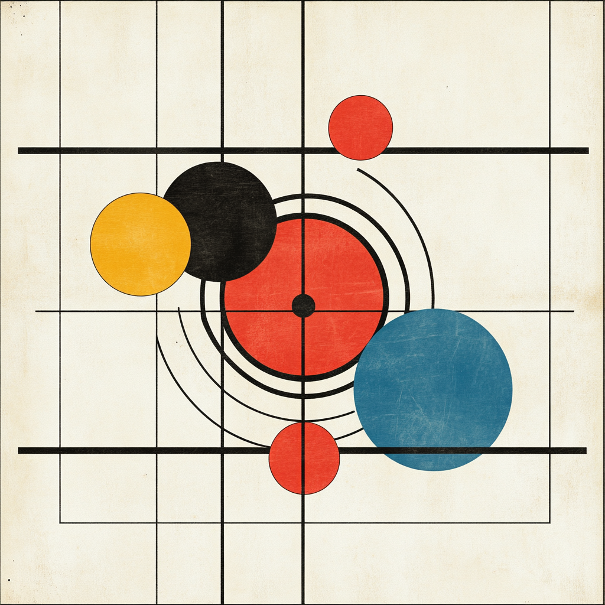

# AI in DevOps, beyond the buzzwords

## Why AI in DevOps?

AI, especially large language models (LLMs), is currently riding a wave of excitement that often outpaces its practical utility.&#x20;

In DevOps, where stability, precision, and auditability matter, the idea of letting a predictive model touch your deployment pipeline is worth scrutinizing.

We get it. You're not asking for "AI in DevOps." You're asking for fewer failed deploys, fewer Slack threads about merge conflicts, and fewer late-night debugging sessions caused by a config file buried in a forgotten branch. That’s what this conversation should be about.

You’re not interested in buzzwords. You’re interested in sanity.

\

<figure><figcaption></figcaption></figure>

### DevOps today lacks cohesion

Here’s the current landscape:\
The tools are powerful, but isolated.\
Jira logs the issue. GitHub holds the commit. Slack pings the team. Salesforce owns the change.

None of them talk to each other in a way that feels truly alive.

That’s what we mean by a lack of cohesion. Not dysfunction. Just... drift.

Events that happen in one system don’t ripple across others.\
Deployments succeed, but no one’s informed.\
A ticket’s status changes, but nothing downstream reacts.\
Code gets pushed, but no one knows what it’s connected to.

AI could fix this, in theory.

But most AI tools today? They’re still stuck in the sandbox.

A one-off prompt. A chatbot bolted onto the terminal.

Nice for a demo. Not so great when the stakes are real.

Why? Because these tools weren’t built with DevOps in mind.\
They weren’t built with memory, state, or coordination.\
They weren’t built to reason across systems.

***

<figure><figcaption></figcaption></figure>

### The endgame is clarity

There’s a reason DevOps has always gravitated toward dashboards and observability tools:\
We don’t want magic. We want insight.

The more the system does, the more we want to understand it.

That’s the real challenge of AI in DevOps, using black-box tech to create see-through systems.

Let AI do the legwork. But give humans the map. The receipts. The audit trail.

This isn’t just a tooling challenge. It’s a UX one. A trust one.

The best AI doesn’t just work. It shows its work.

***

### What DevOps really needs from AI

DevOps doesn’t need a new terminal toy.\
It needs a command center.

A place where events, actions, and intent converge.

What does that look like?

* AI agents that don’t just respond, they remember.
* Workflows that pause, resume, and evolve as context shifts.
* Decisions that are logged, referenced, and understood by the system.
* A unified state, not just a pile of siloed tools.

Cohesion over chaos.\
Intelligence over repetition.\
Clarity over abstraction.

That’s the shift. Not “AI for DevOps.”\
But AI that finally makes DevOps feel like one system, not seven glued together.

***

### The real potential of AI in DevOps

If done right, AI won’t replace your team, it’ll amplify it. Here’s what that actually looks like:

* Intent-driven workflows
  * “When X happens in Jira, trigger Y in GitHub and notify Z in Slack.” No glue code required.
* Predictive conflict detection
  * Surfacing merge conflicts before they break things, not after.
* Stateful memory
  * Agents that remember past exceptions and avoid them in future workflows.
* Human-readable summaries
  * Context-rich recaps of what changed, why it changed, and what it impacts.
* Cohesion at scale
  * Not automation for automation’s sake. But real orchestration across your stack.

We’re building this at SRE.ai because we believe AI should serve the team, not mystify it.

***

### Want to talk shop?

We’re always down to trade stories. Compare scars. Debate whether “auto-merge” is a feature or a curse.

If you’re trying to bring clarity to your chaos, we want to hear from you.

Reach out, or just follow along as we build in public.

\
