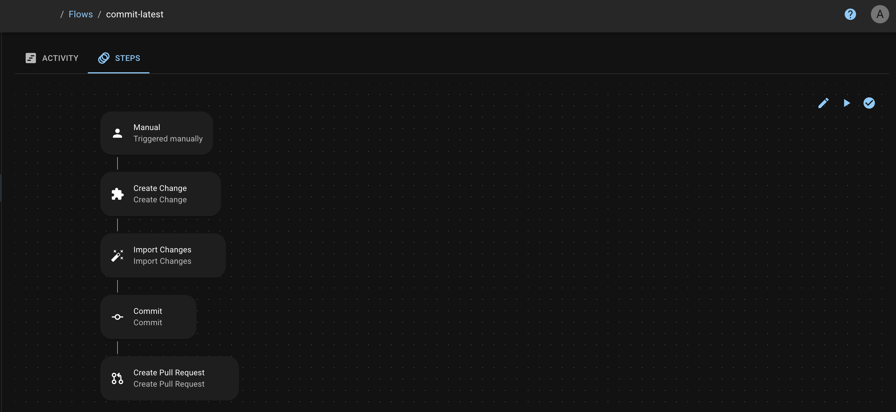
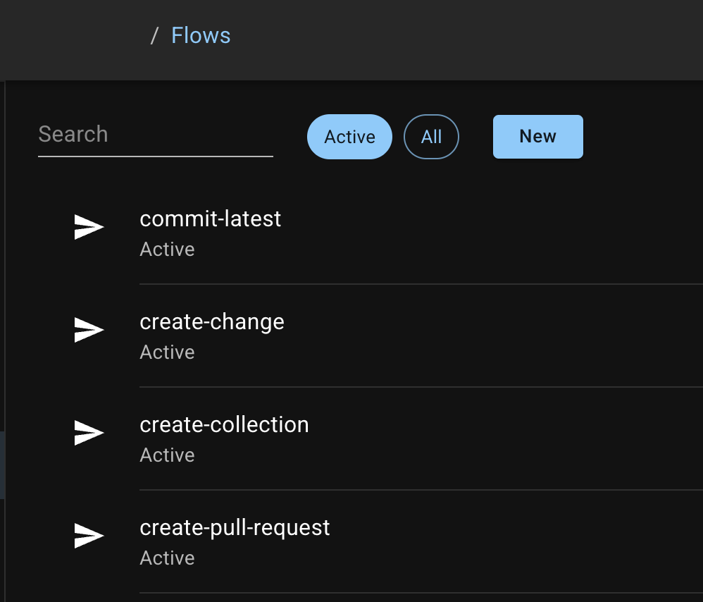

# Flows

<figure><figcaption></figcaption></figure>

## Overview

Flows empower you to orchestrate complex, multi-step processes seamlessly.&#x20;

Flows integrate various applications and trigger criteria to streamline operations.

## **Features**

### **Triggers for automation**

Flows features Triggers to automate DevOps workflows based on specific criteria.&#x20;

Triggers allow you to initiate processes exactly when needed, whether it's:

* After a commit,&#x20;
* After a change in a Jira issue
* During a scheduled time.

Learn more about Triggers in[ SRE.ai's Triggers documentation](triggers/).

### **Declarative approach**

Flows take a declarative approach.&#x20;

With Flows, you define what you want to achieve without worrying about the technical details of how it gets done.

Flows make it accessible for users of all technical backgrounds and reduce the learning curve significantly.

### **Multi-Step process orchestration**

Flows lets you orchestrate complex workflows involving multiple steps and dependencies.

Flows ensure steps execute in the correct order. You define the right conditions and criteria to keep the process smooth and error-free.

### Comprehensive element support

Flows come packed with a robust set of supported elements, allowing you to customize your workflows to meet your specific needs.

Think of elements as building blocks, each supporting a particular step or function.

Here are some functions you can execute with flows:

* Create a pull request post a commit activity
* Promote changes when a pull request is approved
* Automatically update a Jira issue when you promote a change to an environment.
* Enable continuous integration and continuous deployment
* Create and install package versions based on git operations
* Maintain a pool of scratch-orgs with up-to-date packages, data, and configurations
* Enhance team communication by posting messages to Slack channels directly from your workflows

## **Getting started with Flows**

### **Main page**

<figure><figcaption></figcaption></figure>

By default, the Flows page only displays Active Flows.

Click **the "All" button** to view every Flow in your system.

Click on an existing Flow to view or edit the Flow.

### Create new Flow

Click **the "New" button** to name and create a new Flow.

<figure><figcaption></figcaption></figure>

Get started with Flows by:

* Defining your workflow with the intuitive interface
* Setting your triggers
* Selecting the necessary elements

Flows will take care of the rest, ensuring your processes run smoothly and efficiently.
