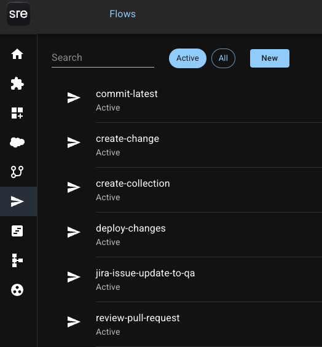
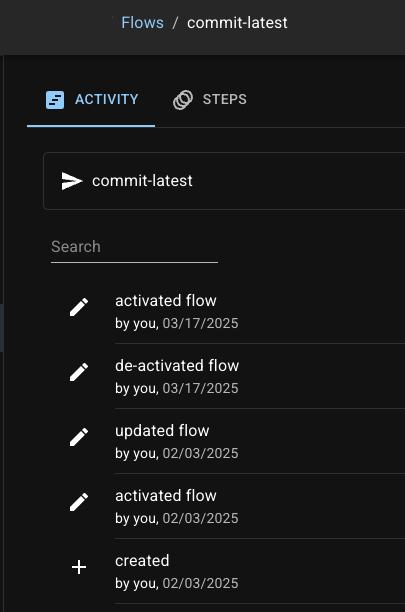

# Flows

<figure><figcaption></figcaption></figure>

## Overview

Flows empower you to orchestrate complex, multi-step processes seamlessly.&#x20;

Flows integrate various applications and trigger criteria to streamline operations.

Flows take a declarative approach.&#x20;

With Flows, you define your goals without worrying about the technical details of how they are achieved.

Flows make it accessible to users of all technical backgrounds and significantly reduce the learning curve.

## **Features**

### **Triggers**

Triggers initiate a Flow.

Triggers allow you to initiate a Flow exactly when needed, whether it's:

* After a manual activation
* After a change in an app such as Jira
* During a scheduled time
* After a commit&#x20;
* After a promotion
* After a deployment

Learn more about Triggers in[ SRE.ai's Triggers documentation](triggers/).

### **Steps**&#x20;

Steps define a Flow's execution.

Steps allow you to arrange the sequence of instances and dependencies that will occur after a Trigger.

Moreover, you can define specific conditions and criteria to keep a Step's execution smooth and error-free.

Learn more about Steps in [SRE.ai's Steps documentation](steps/).

### Comprehensive workflow support

Combining Triggers and Steps allows you to customize your workflows to meet your specific needs.

Here are some functions you can execute with combinations of Triggers and Steps:

* Promote changes when a pull request is approved
* Automatically update a Jira issue when you promote a change to an environment.
* Enable continuous integration and continuous deployment
* Create and install package versions based on git operations
* Maintain a pool of scratch-orgs with up-to-date packages, data, and configurations
* Enhance team communication by posting messages to Slack channels directly from your workflows

Learn more about example Flows by reading [SRE.AI's Flows Cookbook documentation](cookbook.md).

## **Getting started with Flows**

### **Main page**

<figure><figcaption></figcaption></figure>

By default, the Flows page only displays active Flows.

**Click the "All" button** to view every Flow in your system.

**Click on an existing Flow** to view or edit the Flow.

### Create new Flow

**Click the "New" button** in the main page to name and create a new Flow.

<figure><figcaption></figcaption></figure>

In the Flow Builder, click **the Edit button** to add or remove Steps and edit existing Triggers and/or Steps.

<figure><figcaption></figcaption></figure>

Click **the Activation button** to activate your Flow after you have arranged your desired Triggers and Steps.

<figure><figcaption></figcaption></figure>

Flows will take care of the rest, ensuring your processes run smoothly and efficiently.

### Activity

Click the Activity tab in the Flow Builder to view the history of the given Flow.

<figure><figcaption></figcaption></figure>
