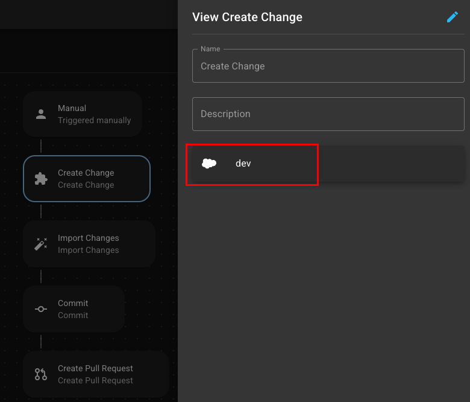

# Flows cookbook

## Overview

The SRE.ai Cookbook is your launchpad for building smarter, faster automations.

Think of it as a collection of real-world recipes, showcasing how you can combine **Triggers** (the events that kick things off) and **Steps** (the actions that follow) to streamline your DevOps workflows.

Unlike traditional "cookbooks" packed with code and tests, SRE.ai makes automation **intuitive**.&#x20;

Each recipe gives you a simple blueprint: what happens, when it happens, and how it moves work forward.&#x20;

No scripting required.

Whether you're looking to **auto-promote changes after approval**, **sync updates to Jira**, or **notify your team in Slack**, our Cookbook helps you see what's possible and sparks ideas for your own custom Flows.

Use these examples as starting points.

Tweak them. Remix them. Make them yours.

### What you’ll find

* **Pre-built Flow templates**:
  * Ready-to-deploy Flows that bundle common sequences of triggers and steps for Salesforce DevOps tasks (like promoting changes after a Pull Request is approved).
* **Trigger and Step combination outlines**:
  * Each recipe outlines a logical chain of automation: when a specific trigger occurs (e.g., a commit to a branch), a sequence of steps (e.g., create a pull request, promote changes, update a Jira issue) automatically follows.
* **Customization guidance**:
  * Each recipe serves as a starting point. You can adapt and extend them by adding conditions, steps, or human-in-the-loop checkpoints to fit your specific DevOps needs.

***

## Example Cookbook Recipes

### Commit latest pull request

<figure><figcaption></figcaption></figure>

**Goal:**\
Quickly package and commit the latest changes from your Salesforce environment, creating a pull request for review.

**Best for:**\
Teams that want to simply the commit process, maintain clean version control, and accelerate deployment pipelines by bundling:

* Change tracking
* Imports
* Commits
* PR creation

**Trigger:**

The user manually activates the Trigger.

<figure><figcaption></figcaption></figure>

**Steps:**

1. Select a Source Instance for the Create Change Step

<figure><figcaption></figcaption></figure>

2. Set the Scope and Time Range for the Import Changes Step

<figure><figcaption></figcaption></figure>

3. Select a Repository and Commit type for the Commit Step

<figure><figcaption></figcaption></figure>

4. Select a Connection and Destination branch for the Create Pull Request Step

<figure><figcaption></figcaption></figure>

### Review pull request

<figure><figcaption></figcaption></figure>

**Goal:**\
Automatically review incoming pull requests to enforce best practices, streamline approvals, and generate AI-powered summaries of changes.

**Best for:**\
Teams looking to accelerate their pull request review process while maintaining quality, consistency, and visibility into key changes.

**Trigger:**

Triggered by Github

<figure><figcaption></figcaption></figure>

**Steps:**

1. Edit the Pull Request Exception Step to Check for Skip Test by:
   1. Selecting a Connection
   2. Labelling the Pull Request Action as "Skip Test"
   3. Setting the Criteria to Exclude your selected Types

<figure><figcaption></figcaption></figure>

2. Edit the Pull Request Exception Step to Check for Skip Reviews by:
   1. Selecting a Connection
   2. Labelling the Pull Request Action as "Skip Reviews"
   3. Turning the Auto Approve toggle on
   4. Setting the Criteria to Exclude your selected Types

<figure><figcaption></figcaption></figure>

3. Edit the Summarize Change Step by:
   1. Selecting a Connection
   2. Selecting Key Changes adn Implementation Details as Summary topics
   3. Selecting SRE.ai Salesforce 1.0 as an AI model

<figure><figcaption></figcaption></figure>

### Update Jira issue after deployment

<figure><figcaption></figcaption></figure>

**Goal:**\
After successfully deploying a Collection, automatically update the corresponding Jira ticket to reflect the deployment status.

**Best for:**\
Teams using Jira to track release readiness and QA coordination.

**Trigger:**

A Collection deploys.

<figure><figcaption></figcaption></figure>

**Steps:**

1. Update the related Jira Issue (e.g., transition status to "Deployed to QA" or "Ready for Testing").
   1. Add a comment linking the deployment record or Collection ID.

<figure><figcaption></figcaption></figure>

### Update collection

<figure><figcaption></figcaption></figure>

**Goal:**\
Automatically keep Collections in sync with active Jira issues by adding relevant issues when created or updated, and promptly removing them when conditions change. Ensure Collection reflect only current, actionable work.

**Best for:**\
Teams managing dynamic workspaces who want to automate the tracking of Sprint-related Jira issues without manually maintaining Collections.

**Trigger:**

Triggered by a Jira issue that starts with "CRM" that is assigned to a spring and is newly created or updated.

<figure><figcaption></figcaption></figure>

**Steps:**

1. **Add to Collection** – The triggered issue is added to a relevant Collection

<figure><figcaption></figcaption></figure>

1. **Remove from Collection** – The issue is subsequently removed, likely to clean up the Collection once the condition changes or is no longer relevant

<figure><figcaption></figcaption></figure>

### Track changes

<figure><figcaption></figcaption></figure>

**Goal:**\
\[Text goes here]

**Best for:**\
\[Text goes here]

**Trigger:**

* \[Text goes here]

**Steps:**

1. \[Text goes here]

### \[Example]

**Goal:**\
\[Text goes here]

**Best for:**\
\[Text goes here]

**Trigger:**

* \[Text goes here]

**Steps:**

1. \[Text goes here]

### \[Example]

**Goal:**\
\[Text goes here]

**Best for:**\
\[Text goes here]

**Trigger:**

* \[Text goes here]

**Steps:**

1. \[Text goes here]

