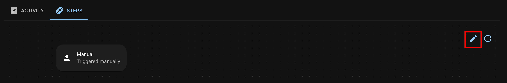
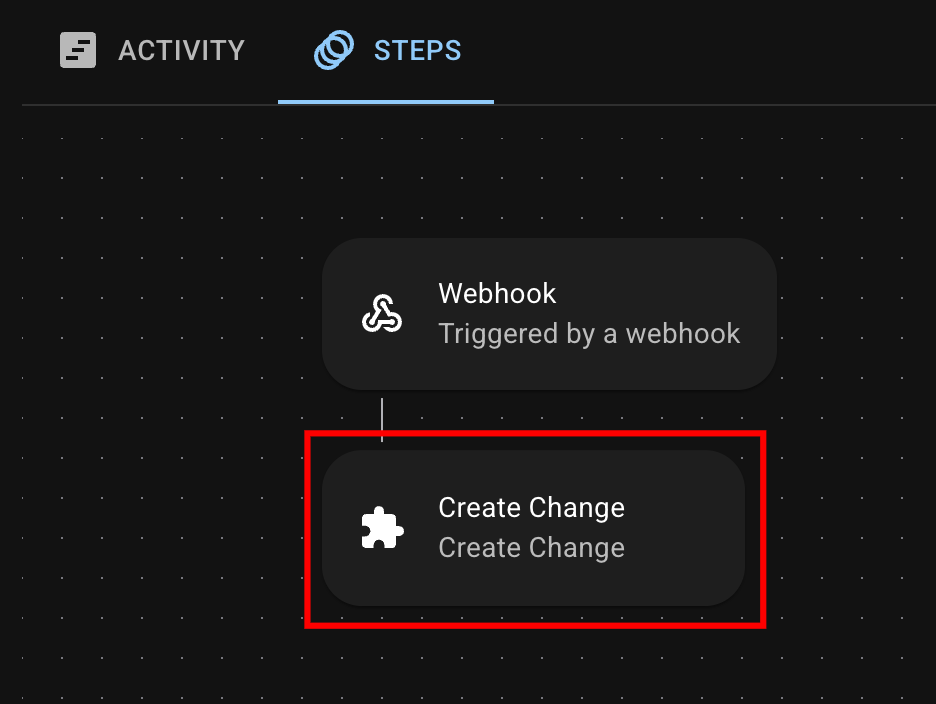

# Steps

## What are Steps?

Steps are the actions that your Flow performs after being triggered.&#x20;

You can string multiple Steps together to create powerful, rule-based automations across your DevOps pipeline.

***

## Available Steps

SRE.ai offers eighteen Step types:

* Create Change
* Create Collection
* Add to Collection
* Remove from Collection
* Import Changes
* Commit
* Promote
* Deploy
* Install Package
* Create Package Version
* Create Scratch Org
* Update Jira Issue
* Create Pull Request
* Review Pull Request
* Pull Request Exception
* Summarize Change
* List Components
* Post a Slack Message

***

## How Steps work in SRE.ai

### Adding or deleting Steps

In the Flow Builder, select the Edit Flows icon to add or delete Steps.

<figure><figcaption></figcaption></figure>

### Editing exisiting Steps

Click any Step in a Flow to open the View Step panel

<figure><figcaption></figcaption></figure>

Click **the Edit button** in the top right of the View Step panel to edit the Step's parameters.

<figure><figcaption></figcaption></figure>

### Customization

Learn more about the customizable parameters for each Step by reading[ SRE.ai's Steps customization documentation](steps-customization.md).
