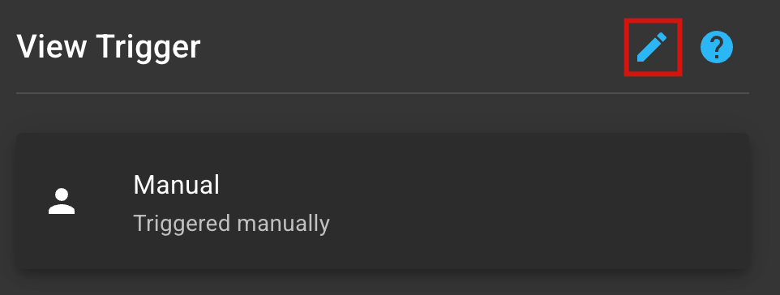

# Triggers

## What are Triggers?

Triggers are the entry points to a Flow in SRE.ai.&#x20;

Each Trigger listens for a specific event, such as:

* A pull request opening
* A commit being merged
* A manual user action&#x20;

Triggers initiate Flows once their specific event occurs.

Triggers help you respond automatically to DevOps activity without polling, scripts, or brittle automations.

***

## Available Triggers

SRE.ai offers six different Triggers:

* Manual&#x20;
* Schedule
* Webhook
* Commit
* Promote
* Deployment

<figure><figcaption></figcaption></figure>

***

## How Triggers work

Click on a Trigger in the Flow builder to open the View Trigger panel.

<figure><figcaption></figcaption></figure>

Click **the Edit button** in the top right of the View Trigger panel to edit the Trigger type.

<figure><figcaption></figcaption></figure>

### Customization

Each Trigger features customizable parameters.

Learn more about the customizable parameters for each Trigger by reading [SRE.ai's Triggers customization documentation](triggers-customization.md).
