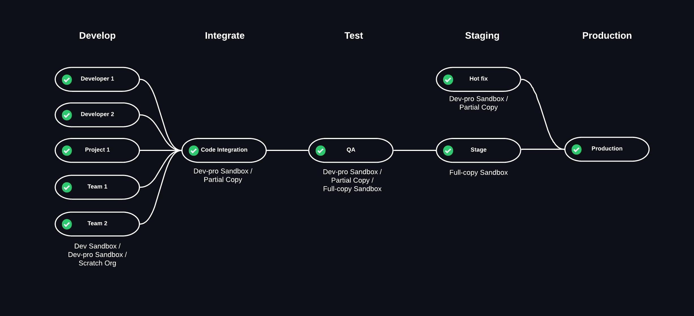

# Release management strategies

An effective release management process requires a stable, practical environment strategy and a clear branching strategy.

### Environment Strategy

An Environment Strategy outlines the efficient, reliable, and sustainable management and deployment of software to various environments (e.g., development, testing, staging, etc.) used in the software development process.

An environment strategy may include automation techniques and measures to ensure proper configuration and maintenance of the environments.

SRE.ai provides instances that connect to Salesforce environments (Production, Sandbox, or Scratch Orgs) and abstract the underlying environment, which may change over time.

You can assign an instance to a branch that reflects the current state of the environment. You can also connect such an instance to a parent instance representing the next environment in the release process. For example, a child instance for development can connect to a parent instance for quality assurance.

A parent instance can have multiple child instances, forming a hierarchy. The hierarchy enables features to flow forward to the parent instance through the promote process. Features can flow backward to other child instances through the back promote process.

A typical Environment Strategy may look like this:

<figure><figcaption></figcaption></figure>

### Branching Strategy

A Branching Strategy organizes and stores different versions of code in a source control repository.

A branch represents a separate line of development. Branches enable multiple developers to work on the same codebase simultaneously without affecting each other's work.

SRE.ai uses a hybrid git branching strategy that combines the best of Feature Branching and [GitFlow](https://www.gitkraken.com/learn/git/git-flow).

In a Branching Strategy, developers typically create a separate branch for each new feature. By default, each separate branch originates from the repository's designated main branch. This approach ensures that the new feature builds on a stable version of the code.

<figure><figcaption></figcaption></figure>

A repository can have a main branch other than "main" or "master", for example, you can have a long-term project represented by a long-term repository. When you create a feature branch from an instance connected to the long-term repository, it will be based on the long-term main branch rather than "main" or "master". This eliminates the need for frequent merging which can be better aligned with certain project milestones.
