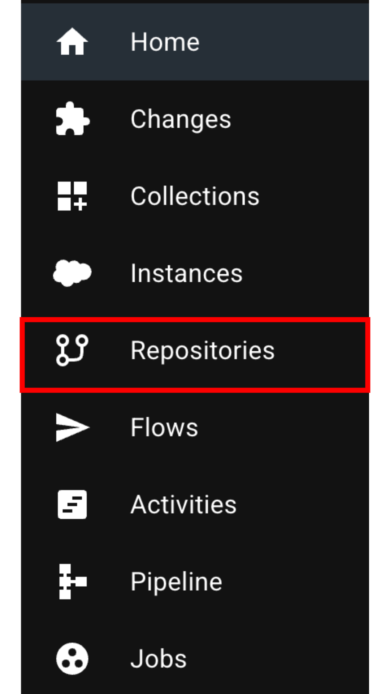

# Repostitories

<figure><figcaption></figcaption></figure>

With repositories, you can connect to any source code repository that uses Git.

To get started, point the remote path to the desired repository. From there, you can perform various [Git operations](https://git-scm.com/docs) within the application interface.

<figure><figcaption></figcaption></figure>

Committing through the application interface integrates your commits and feature branches with the change, allowing you to move them up the environment chain with ease. Meanwhile, the application automatically manages the git workflows in the background.

<figure><figcaption></figcaption></figure>

SRE.ai supports three source code formats:

* **Metadata** - the traditional metadata source format. This format can be challenging to manage due to the size of source files.
* **Source** - the [Salesforce DX Source Format](https://developer.salesforce.com/docs/atlas.en-us.sfdx_dev.meta/sfdx_dev/sfdx_dev_source_file_format.htm).
* **Extended Source** - an extension of the [Salesforce DX Source Format](https://developer.salesforce.com/docs/atlas.en-us.sfdx_dev.meta/sfdx_dev/sfdx_dev_source_file_format.htm), with additional breakdowns for complex types such as RecordTypes, Profiles, and PermissionSets

The Source and Extended Source formats facilitate managing the source code and making changes at every stage of the development process.


IMPORTANT: The 'sfdx-project.json' file must be present at the root of the source folder for both the Source format and Extended Source format. Both formats adhere to [the Salesforce DX Project Configuration guidelines](https://developer.salesforce.com/docs/atlas.en-us.sfdx_dev.meta/sfdx_dev/sfdx_dev_ws_config.htm).\
\
The 'packageDirectories' section of the 'sfdx-project.json' file feeds into the Package Directory options when performing the commits and promotions.


We recommend switching to the Extended Source format in SRE.ai. The Metadata and Source formats exhibit performance limitations with large file sizes. Moreover, on teams with multiple developers updating the same metadata, merging concurrent updates into a single file can be resource-intensive and susceptible to errors.

SRE.ai features a source converter utility to assist with the transition between the Metadata and Extended Source formats.

<figure><figcaption></figcaption></figure>
