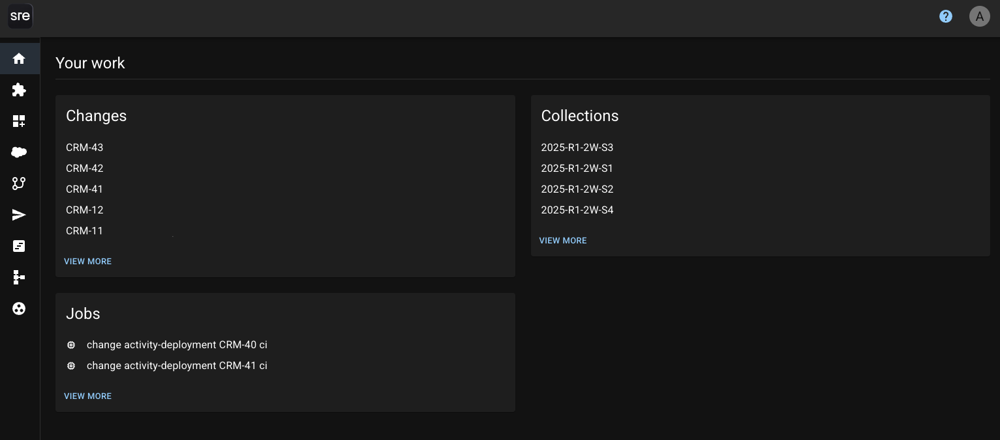
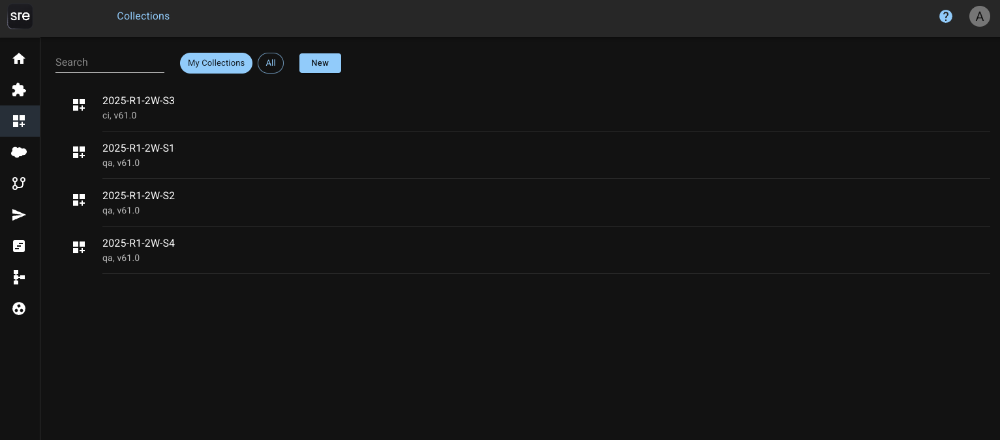
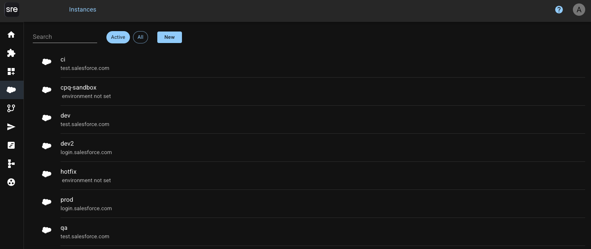
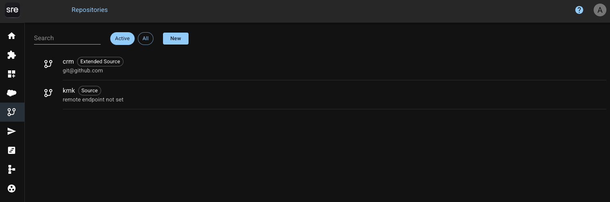
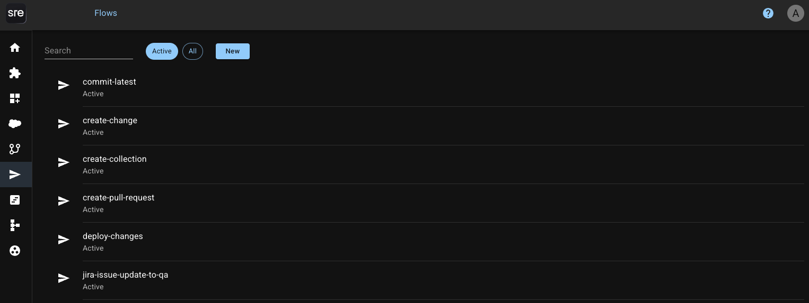
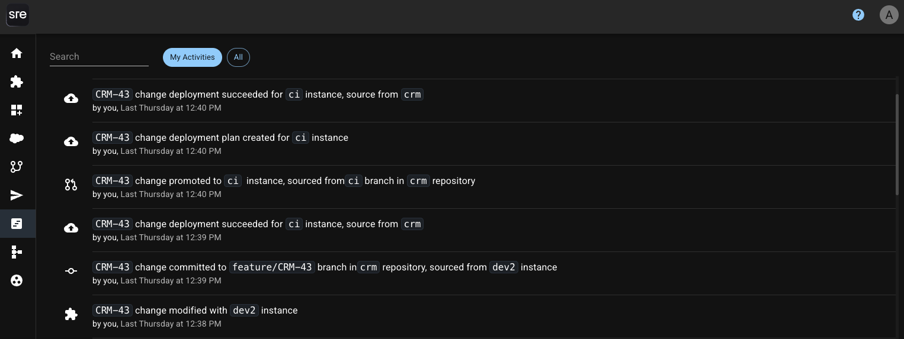
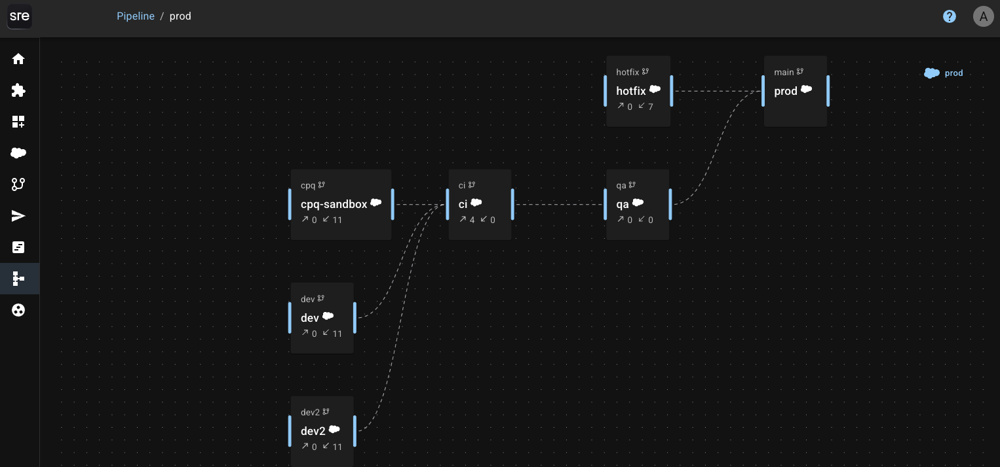
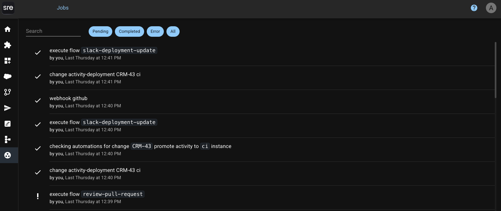

# Navigation

<figure><figcaption></figcaption></figure>

## **Overview**

SRE.ai is designed to streamline the full DevOps lifecycle across three pillars: **Development**, **Deployment**, and **Maintenance**.&#x20;

The sidebar organizes core tools and workflows that map directly to this lifecycle.

***

## **Home**

<figure><figcaption></figcaption></figure>

The Home tab provides a high-level overview of recent activity, environment health, and relevant updates across your connected systems.

***

## **Changes**

<figure><figcaption></figcaption></figure>

Track and manage metadata and code changes in real time.

Use the Changes tab to view detected updates, compare metadata, and commit code. This is where you define what’s changing, when, and why before rolling it into a Collection or deployment.

Learn more about Changes in [SRE.ai's Changes documentation.](images-and-media/changes.md)

***

## **Collections**

<figure><figcaption></figcaption></figure>

Group multiple changes into a single unit of work.

Collections let you group changes that belong together, whether you're working on a new feature, a bug fix, or a release. Track their progress, assign them to teammates, and promote them in one go.

Learn more about Collections in [SRE.ai's Collections documentation.](images-and-media/collections.md)

***

## **Instances**

<figure><figcaption></figcaption></figure>

Manage the orgs or environments connected to your repository.

Each instance corresponds to a Salesforce environment (e.g., Dev, QA, Staging) and can be assigned to a branch. Use this section to spin up environments, track status, or reset configurations.

Learn more about Instances in [SRE.ai's Instances documentation.](images-and-media/instances.md)

***

## Repositories

<figure><figcaption></figcaption></figure>

Configure and connect Git repositories used for version control.

Link your repositories, define source formats, and control Git behavior. This is the foundation of your DevOps pipeline, ensuring your environments and version control are in sync.

Learn more about Repositories in [SRE.ai's Repositories documentation](images-and-media/repostitories.md).

***

## **Flows**

<figure><figcaption></figcaption></figure>

Create declarative workflows using triggers and steps.

Flows let you define custom automations for your team, from triggering deployments to updating Jira. Build workflows with a few clicks and eliminate repetitive manual steps.

Learn more about Flows in SRE.ai's Flows documentation.

***

## **Activities**

<figure><figcaption></figcaption></figure>

View a detailed log of actions taken across the platform.

Activities show who did what, when, including:&#x20;

* Promotions
* Commits
* Deployments
* Flow executions

Activities help you audit what happened, when, and by whom, bringing transparency to your entire release cycle.

***

## **Pipeline**

<figure><figcaption></figcaption></figure>

Monitor end-to-end CI/CD pipelines.

The pipeline view connects repositories, environments, and automation flows to give you a bird’s-eye view of your release process.

***

## **Jobs**

<figure><figcaption></figcaption></figure>

Track automated or manually triggered executions.

Jobs represent deployments, flow runs, environment resets, or metadata syncs. This view provides visibility into job status, logs, and results.

***

\
